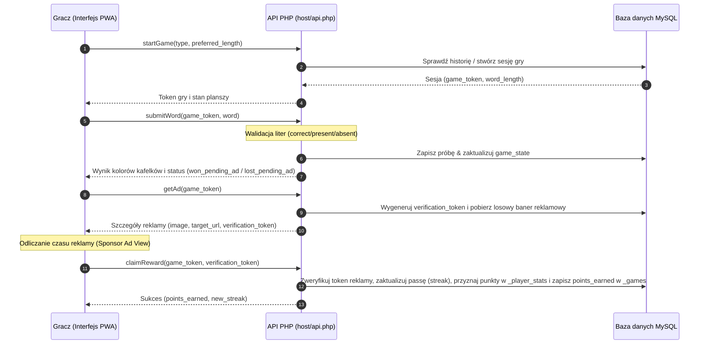

# YIN Custom Loyalty Wordle - Wordle Gamification
> **Zaawansowany moduł grywalizacyjny dla programu lojalnościowego PrestaShop, angażujący klientów poprzez codzienną minigrę słowną Wordle i nagradzający ich punktami lojalnościowymi za odgadnięcie słowa dnia.**

---

[](https://www.prestashop.com/)
[](https://en.wikipedia.org/wiki/Proprietary_software)
[](https://www.php.net/)
[](https://vitest.dev/)
[](https://playwright.dev/)

---

## 📖 O projekcie

**YIN Custom Loyalty Wordle** to innowacyjny moduł rozszerzający funkcjonalność systemu lojalnościowego `yin_customloyalty`. Wprowadza on do e-sklepu mechanizmy grywalizacji (Gamification) poprzez popularną na całym świecie grę słowną **Wordle**.

Zasada działania opiera się na budowaniu nawyku codziennego logowania (Retention Rate): raz na dobę gracz ma możliwość odgadnięcia ukrytego słowa klucza. Za pomyślne rozwiązanie zagadki w maksymalnie 6 próbach, po obejrzeniu krótkiej reklamy sponsora, portfel lojalnościowy gracza zostaje zasilony punktami lojalnościowymi.

---

## 🗺️ Stan obecny (Co zostało wykonane?)

Zakończyliśmy kluczowy etap transformacji z izolowanego MVP działającego offline do **w pełni zintegrowanego systemu klient-serwer** połączonego z bazą danych MySQL (za pośrednictwem dedykowanego API PHP). 

Oto szczegółowy podział wdrożonych funkcjonalności:

### 1. 🌐 Komunikacja z API i Bezpieczna Weryfikacja
*   **Architektura API PHP (`host/api.php`):** Bezpieczne wejście aplikacji będące jedynym źródłem prawdy (Source of Truth). Obsługuje akcje `startGame`, `submitWord`, `getAd`, `claimReward`, `getUserStats`, `getLeaderboard` oraz `updateNickname`.
*   **Jednorazowe sesje i Tokeny:** Każda gra generuje unikalny token sesji zapisywany w bazie. Ukończenie reklamy sponsorskiej jest weryfikowane po stronie serwera za pomocą jednorazowych żetonów (`verification_token`), co uniemożliwia sztuczne dodawanie punktów w konsoli przeglądarki.

### 2. 📺 Brama Reklamowa (Sponsor Ad Gateway)
*   **Dynamiczne Reklamy z Bazy:** Reklamy są pobierane losowo z tabeli reklamowej (`_ads`), zawierając spersonalizowany tytuł, klikalny link docelowy oraz grafikę banerową.
*   **Elastyczny Interfejs Baneru:** Dostosowany do proporcji ekranu (CSS `object-fit: contain` na czarnym, eleganckim tle), eliminując rozciąganie obrazu.
*   **Znikający licznik:** Komunikat informujący o odliczaniu czasu pominięcia reklamy automatycznie znika po upływie czasu, odsłaniając estetycznie przycisk odbioru nagrody.

### 3. 📊 Globalny Ranking Online (Leaderboard)
*   **Wydajne zapytania MySQL:** Ranking pobiera Top 10 najlepszych graczy sortując według punktów oraz najlepszej serii zwycięstw (streak). Nie obciąża bazy dzięki rezygnacji z niepotrzebnych powiązań JOIN z zewnętrznymi tabelami klientów PrestaShop.
*   **Wysuwane Szuflady Statystyk (Expandable Drawers):** Kliknięcie dowolnego gracza w rankingu płynnie wysuwa dedykowany panel z precyzyjnymi statystykami grywalizacji:
    *   *Bieżąca passa* (Current Streak)
    *   *Suma wygranych gier codziennych* (Daily Won Count)
    *   *Wskaźnik wygranych gier treningowych* (Free Play Win Ratio %)
*   **Osobisty Pulpit Gracza:** Na dole modalu wyświetla się spersonalizowana karta podsumowująca Twoje dokładne miejsce w rankingu, sumę punktów i pełne statystyki.

### 4. ✏️ Własne Pseudonimy Graczy (Custom Nicknames)
*   **Modyfikacja Profilu:** W zakładce ustawień dodano dedykowaną sekcję umożliwiającą wpisanie własnego nicku (maksymalnie 20 znaków).
*   **Walidacja:** System oczyszcza pseudonimy ze znaków specjalnych i tagów HTML, zachowując polskie znaki diakrytyczne oraz spacje, po czym bezpiecznie zapisuje je w bazie danych.
*   **Hierarchia Wyświetlania Nazw:** System w rankingu i nagłówku priorytetyzuje nazwy w następujący sposób:
    1.  *Nickname* zdefiniowany przez gracza.
    2.  Domyślny fallback: `"Gracz #ID"`.

### 5. 💰 Ewidencja Punktów per Gra
*   Nowa kolumna `points_earned` w tabeli `_games` na bieżąco rejestruje dokładną ilość punktów przyznaną za ukończenie konkretnej rozgrywki (z uwzględnieniem bonusu za streak), co pozwala na precyzyjną analitykę aktywności graczy.

---

## 🏗️ Przepływ danych w grze (Sequence Diagram)

Oto aktualny schemat komunikacji sieciowej od otwarcia gry do odebrania nagrody lojalnościowej:



---

## 🗄️ Struktura Katalogów Projektu

```text
yin_customloyalty_wordle/
├── src/                          # Kod źródłowy TypeScript (Source of Truth!)
│   ├── app.ts                    # UI controller, obsługa DOM, ranking, dynamiczny pseudonim, animacje drawerów
│   └── mockApi.ts                # Łącznik API (fetch HTTP), mockowa baza LocalStorage dla testów jednostkowych
├── pwa_mvp/                      # Skompilowane pliki produkcyjne (Serwowane do przeglądarki!)
│   ├── app.js                    # Skompilowany kontroler UI
│   ├── mockApi.js                # Skompilowany silnik gry
│   ├── index.html                # Punkt wejścia aplikacji (Siatka, Modale)
│   ├── style.css                 # Główne arkusze stylów (Container Queries, animacje drawerów)
│   ├── manifest.json             # PWA Manifest
│   └── sw.js                     # PWA Service Worker (Zapis offline)
├── host/                         # Backend produkcyjny (PHP + MySQL)
│   ├── api.php                   # Główny kontroler API PHP i router akcji
│   └── schema.sql                # Schemat struktury bazy danych dla hostingu
├── tests/                        # Kompleksowy pakiet testów automatycznych
│   ├── unit/                     # Testy jednostkowe logiki silnika
│   │   └── mockApi.test.ts       # Testy Vitest (Happy DOM) dla WordleMockBackend i obsługi pseudonimów
│   └── e2e/                      # Testy integracyjne i interfejsu (End-to-End)
│       └── wordle.spec.ts        # Testy Playwright (interakcje, brama reklamowa, offline, kafelki)
├── tsconfig.json                 # Konfiguracja kompilatora TypeScript
├── vitest.config.ts              # Konfiguracja środowiska testów jednostkowych Vitest
└── playwright.config.ts          # Konfiguracja przeglądarek testowych Playwright
```

---

## 🧪 Potwierdzona Jakość i Testy (100% Success)

Projekt posiada w pełni skonfigurowane, automatyczne środowisko testowe, które gwarantuje brak regresji przy wprowadzaniu nowych zmian. 

Wszystkie testy uruchamiane są lokalnie oraz automatycznie przy każdym wypchnięciu zmian do repozytorium (CI/CD GitHub Actions):

*   **15/15 Testów jednostkowych Vitest (`npm run test:unit`)** — w odizolowanym środowisku testowana jest cała logika silnika, obsługa uaktualniania pseudonimów, podwójne odbieranie nagród, walidacja słownika i generowanie passy. **Status: PASSED**.
*   **9/9 Testów integracyjnych Playwright (`npm run test:e2e`)** — testują zachowanie w prawdziwych bezgłowych instancjach przeglądarki Chromium, klikanie, wpisywanie z klawiatury fizycznej i wirtualnej, oraz pełne odliczanie bramki reklamowej. **Status: PASSED**.

---

## 🔮 Plany na następny krok (What's Next?)

W nadchodzącym sprincie deweloperskim skupimy się na pełnej, natywnej integracji z systemem modułów sklepowych PrestaShop 8:

1.  **Przeniesienie plików backendu do oficjalnej struktury modułu:**
    *   Przeniesienie `api.php` do oficjalnej architektury modułu PrestaShop (`/modules/yin_customloyalty_wordle/controllers/front/api.php`).
    *   Adaptacja zapytań bazodanowych na użycie natywnego silnika DB PrestaShop (`Db::getInstance()`) oraz automatycznego dopisywania prefiksów tabel (`_DB_PREFIX_`).
2.  **Integracja z kontem Klienta PrestaShop:**
    *   Automatyczne powiązanie identyfikatora `id_customer` na podstawie zalogowanej sesji ciasteczka PrestaShop (`$this->context->customer->id`), co eliminuje potrzebę przekazywania ID klienta krytycznie w zapytaniach JS i zapobiega nadużyciom.
3.  **Kryptograficzny podpis punktów (HMAC-SHA256):**
    *   Dodanie podpisu kryptograficznego do tokenów reklamowych przy użyciu klucza prywatnego zapisanego w konfiguracji sklepu. Gwarantuje to, że żadne punkty nie zostaną przyznane bez faktycznego, udokumentowanego obejrzenia reklamy na serwerze.
4.  **Panel Konfiguracyjny Back-Office (PrestaShop Admin):**
    *   Zbudowanie formularza ustawień nagradzania punktowego (punkty bazowe za słowo, bonusy za streak).
    *   Wygodny kalendarz do planowania haseł dnia na nadchodzące miesiące.
    *   Menedżer reklam pozwalający na proste wgrywanie grafik sponsorów i przypisywanie im linków docelowych z poziomu administracyjnego panelu sklepu.
