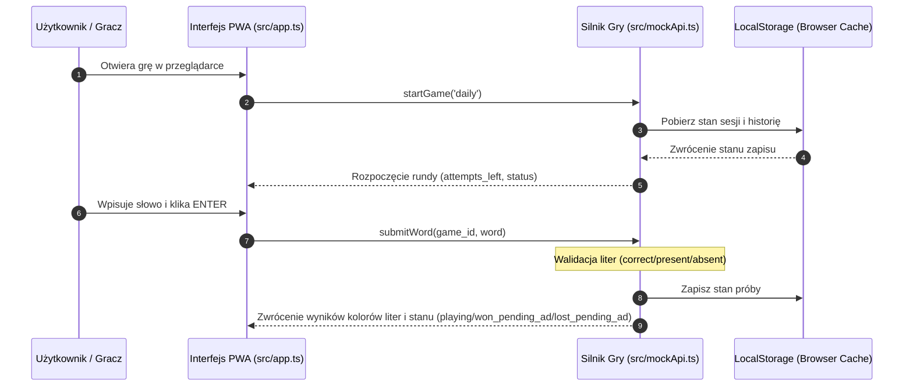

# YIN Custom Loyalty Wordle - Wordle Gamification
> **Moduł gamifikacyjny dla programu lojalnościowego PrestaShop, angażujący klientów poprzez codzienną minigrę słowną Wordle i nagradzający ich punktami lojalnościowymi za odgadnięcie słowa dnia.**

---

[](https://www.prestashop.com/)
[](https://en.wikipedia.org/wiki/Proprietary_software)
[](https://www.php.net/)

---

## 📖 O projekcie

**YIN Custom Loyalty Wordle** to zaawansowany moduł rozszerzający funkcjonalność systemu lojalnościowego `yin_customloyalty`. Wprowadza on do e-sklepu mechanizmy grywalizacji (Gamification) poprzez popularną na całym świecie grę słowną **Wordle**.

Zasada działania jest niezwykle angażująca dla klienta: raz na dobę ma on możliwość odgadnięcia ukrytego, 5-literowego słowa klucza (powiązanego z asortymentem sklepu lub powiązaną branżą). Za pomyślne rozwiązanie zagadki w maksymalnie 6 próbach, portfel lojalnościowy gracza zostaje zasilony punktami. Taki mechanizm buduje nawyk codziennego odwiedzania sklepu (Retention Rate) oraz bezpośrednio wspiera lojalność wobec marki.

### 🗺️ Gdzie jesteśmy i dokąd zmierzamy?
Jesteśmy na **początku drogi tego projektu**. 
* **Etap Obecny (PWA MVP):** Aplikacja działa jako wysoce zoptymalizowana, responsywna aplikacja progresywna (PWA) napisana w **TypeScript**, z silnikiem gry emulowanym po stronie klienta (`localStorage`).
* **Etap Docelowy (Integracja PrestaShop 8):** PWA zostanie wbudowane w natywny moduł PrestaShop 8. Silnik gry (Source of Truth) zostanie przeniesiony na backend PHP, a punkty będą przyznawane w zabezpieczony kryptograficznie sposób bezpośrednio w bazie danych systemu `yin_customloyalty`.

---

## ✨ Główne cechy i funkcjonalności

*   **Mechanika gry Wordle:** Klasyczny silnik gry (6 prób, oznaczanie liter kolorami: zielony - correct, żółty - present, szary - absent) w pełnej polskiej lokalizacji językowej (`PL`).
*   **Mobilny i Responsywny Layout:** Siatka gry zbudowana przy użyciu modern CSS oraz **Container Queries**. Gwarantuje to idealnie kwadratowe, samopozycjonujące się kafelki i optymalny układ klawiatury na każdym telefonie (np. iPhone 12 Pro) bez ucinania widoku.
*   **Wielofunkcyjna Klawiatura:** Przyklejona do dołu ekranu wirtualna klawiatura z dużymi, dotykowymi przyciskami (w tym czytelnymi *ENTER* i *BACKSPACE*) oraz pełna integracja z fizyczną klawiaturą komputerową (`keydown`).
*   **Brama Reklamowa (Ad Gateway):** Blokuje ekran po zakończeniu gry. Użytkownik musi odczekać licznik czasu reklamy sponsorowanej, aby uzyskać token weryfikacyjny odblokowujący przycisk odebrania punktów lojalnościowych.
*   **Obsługa Offline:** Dzięki PWA (Service Worker `sw.js` oraz Web App Manifest) gra ładuje się i informuje o stanie połączenia specjalnym paskiem ostrzegawczym nawet przy całkowitym braku internetu.

---

## 🏗️ Architektura i Przepływ danych

### Przepływ gry (Stan obecny - PWA)


---

## 🗄️ Struktura Katalogów Projektu

```text
yin_customloyalty_wordle/
├── src/                          # Kod źródłowy TypeScript (Source of Truth!)
│   ├── app.ts                    # UI controller, obsługa DOM, zdarzenia, klawiatura, powiadomienia
│   └── mockApi.ts                # Silnik gry, dictionary, system punktacji, ad-gateway, stany sesji
├── pwa_mvp/                      # Skompilowane pliki produkcyjne (Serwowane do przeglądarki!)
│   ├── app.js                    # Skompilowany kontroler UI
│   ├── mockApi.js                # Skompilowany silnik gry
│   ├── index.html                # Punkt wejścia aplikacji
│   ├── style.css                 # Główne, responsywne arkusze stylów
│   ├── manifest.json             # Konfiguracja instalacji PWA
│   └── sw.js                     # PWA Service Worker (Zapis offline)
├── tests/                        # Kompleksowy pakiet testów automatycznych
│   ├── unit/                     # Testy jednostkowe logiki silnika
│   │   └── mockApi.test.ts       # Testy Vitest (Happy DOM) dla WordleMockBackend
│   └── e2e/                      # Testy integracyjne i interfejsu (End-to-End)
│       └── wordle.spec.ts        # Testy Playwright (interakcje, brama reklamowa, offline)
├── .github/workflows/            # Konfiguracja CI/CD
│   └── test.yml                  # Potok testowy uruchamiający testy w chmurze przy pushu
├── tsconfig.json                 # Konfiguracja kompilatora TypeScript
├── vitest.config.ts              # Konfiguracja środowiska testów jednostkowych Vitest
└── playwright.config.js          # Konfiguracja przeglądarek testowych Playwright
```

---

## ⚙️ Jak uruchomić i testować lokalnie?

Lokalny serwer to pierwsze i najważniejsze miejsce testowania gry przed wypchnięciem zmian na produkcję.

### 1. Instalacja zależności deweloperskich
```powershell
# Uruchom w CMD lub PowerShell w katalogu projektu:
cmd /c "npm install"
```

### 2. Kompilacja TypeScriptu do JavaScriptu
Przeglądarka uruchamia pliki `.js` z folderu `pwa_mvp`. Po modyfikacji jakichkolwiek plików w `src/` (TypeScript), musisz je skompilować:
```powershell
cmd /c "npm run build"
```

### 3. Uruchomienie lokalnego serwera
```powershell
cmd /c "npm run serve"
```
Aplikacja zostanie uruchomiona lokalnie. Otwórz w przeglądarce adres:
👉 **[http://127.0.0.1:8080](http://127.0.0.1:8080)**

---

## 🧪 Automatyczne Testy (Unit & E2E)

Projekt posiada w pełni skonfigurowane, automatyczne środowisko testowe.

### Uruchomienie testów jednostkowych (Vitest)
Testują logikę punktacji, limitów prób, verify tokenów reklamowych w odizolowanym środowisku Happy DOM:
```powershell
cmd /c "npm run test:unit"
```

### Uruchomienie testów E2E (Playwright)
Otwierają bezgłową (headless) instancję przeglądarki Chromium, symulują kliknięcia wirtualnej klawiatury, odliczanie reklamy oraz reakcję na brak sieci:
```powershell
cmd /c "npm run test:e2e"
```

### Ciągła Integracja (GitHub Actions)
Każdy push do gałęzi `main` uruchamia potok testowy na GitHubie. Wdrożyliśmy zaawansowane mechanizmy **cachowania**:
*   **Cache Node Modules (`cache: npm`)** – drastycznie skraca czas instalacji zależności.
*   **Cache Playwright Browsers (`~/.cache/ms-playwright`)** – zapobiega ponownemu pobieraniu przeglądarek przy każdym uruchomieniu, oszczędzając ponad 60-80% czasu trwania budowania w chmurze.

---

## 🔮 Przyszły plan rozwoju (Integracja PrestaShop 8)

Gdy przejdziemy do fazy pełnej integracji z ekosystemem modułów PrestaShop 8, zrealizujemy następujące kroki:

1.  **Przeniesienie walidacji słowa na backend (Zabezpieczenie przed cheatowaniem):**
    *   Wpisane przez użytkownika słowo będzie wysyłane żądaniem AJAX do kontrolera frontowego modułu PrestaShop.
    *   Baza danych PrestaShop zweryfikuje, czy słowo jest poprawne i zwróci tablicę z wynikami kolorów liter. Słowo dnia nigdy nie zostanie wysłane do przeglądarki użytkownika przed ukończeniem rozgrywki.
2.  **Integracja bazodanowa:**
    *   **Tabela `ps_bn_yin_customloyalty_wordle_words`** będzie przechowywać słowa dnia ustawiane przez administratora w panelu Back-Office.
    *   **Tabela `ps_bn_yin_customloyalty_wordle_history`** będzie zabezpieczać przed ponownym rozegraniem gry tego samego dnia przez zalogowanego klienta.
3.  **Podpis kryptograficzny nagrody:**
    *   Brama reklamowa wywoła endpoint backendu, który po weryfikacji obejrzenia reklamy wygeneruje unikalny token podpisany kluczem zabezpieczającym (HMAC-SHA256).
    *   Token ten będzie wymagany do zgłoszenia wygranej w module lojalnościowym, co uniemożliwi sztuczne nabijanie punktów z poziomu konsoli JS.
4.  **Panel Zarządzania (Back-Office):**
    *   Możliwość definiowania nagród punktowych (punkty bazowe, bonus za szybkie odgadnięcie, bonus za serię/streak).
    *   Kalendarz słów dnia ułatwiający planowanie haseł na cały rok.

---

## 📝 Warunki Licencyjne i Prawa Autorskie

> [!WARNING]
> **Moduł objęty jest ścisłą licencją komercyjną (Custom Proprietary License).**

Wszystkie prawa do kodu źródłowego, grafik, logiki oraz dokumentacji są zastrzeżone na rzecz autora:
*   **Autor:** Mariusz Opach
*   **Copyright:** © 2026 Mariusz Opach. Wszelkie prawa zastrzeżone.

Bez uprzedniej, pisemnej zgody autora zabrania się:
*   Kopiowania, dystrybucji lub modyfikacji kodu w celach innych niż użytkowanie na licencjonowanej domenie.
*   Odsprzedaży lub udostępniania osobom trzecim.
*   Dekompilacji lub inżynierii wstecznej modułu.
